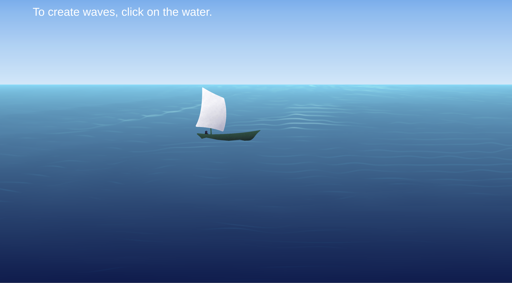

# Water Simulation

This is a stylized scene of a boat floating on the ocean made in Unity. The underlying water simulation is based on a cellular automaton, and, while it has several unrealistic artifacts (such as all waves' propagating at the same rate and having the same frequency), the visual results are impressive. Buoyancy physics for the boat are also derived from the water simulation. The wave caps are drawn as Catmull-Rom splines using the simulation data as control points. The water, wave caps, and boats are all rendered with custom HLSL shaders.

Web demo [here](https://colinmcculloughbenner.github.io/water-sim-demo/).

